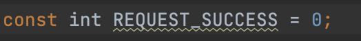
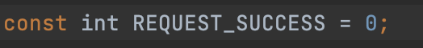
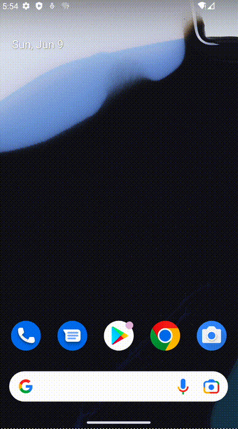
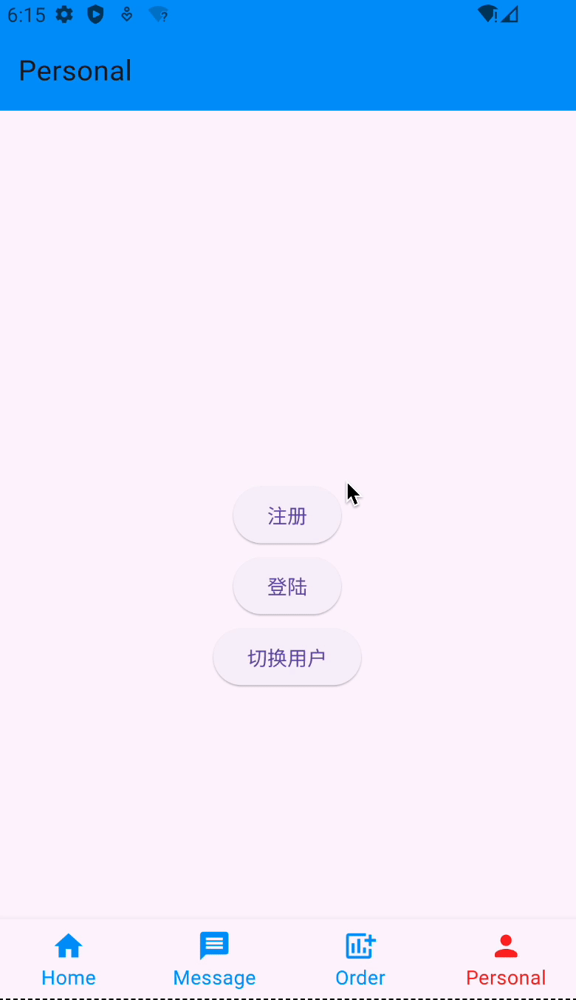
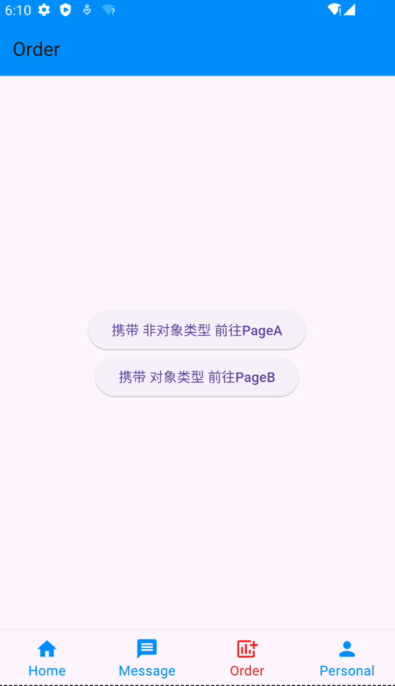
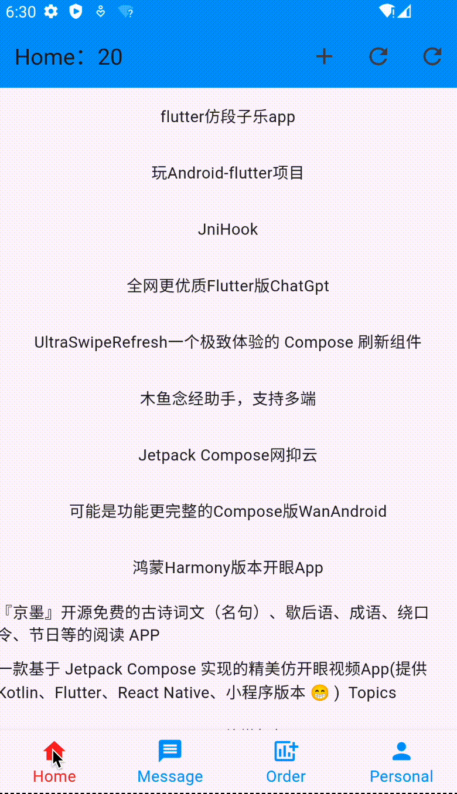

# 前言
当前案例 Flutter SDK版本：**3.22.2**

每当我们开始一个新项目，都会 引入常用库、封装工具类，配置环境等等，我**参考**了一些文档，将这些**内容整合、简单修改、二次封装**，得到了一个**开箱即用**的Flutter开发模版，即使看不懂封装的工具对象原理，也没关系，**模版化的使用方式**，小白也可以快速开发Flutter项目。

# 快速上手

**用到的依赖库**

```js
  dio: ^5.4.3+1 // 网络请求
  fluro: ^2.0.5 // 路由
  pull_to_refresh: ^2.0.0 // 下拉刷新 / 上拉加载更多
```

## 修改规则

默认使用的是Flutter团队制定的规则，但每个开发团队规则都不一样，违反规则的地方会出现**黄色波浪下划线**，比如我定义常量喜欢字母全部大写，这和默认规则不符；

修改 Flutter项目里的 `analysis_options.yaml` 文件，找到 `rules`，添加以下配置；

```js
  rules:
    use_key_in_widget_constructors: false
    prefer_const_constructors: false
    package_names: null
```

**修改前**



**修改后**



## MVVM

*   MVVM 设计模式，相信大家应该不陌生，我简单说一下每层主要负责做什么；
*   Model: 数据相关操作；
*   View：UI相关操作；
*   ViewModel：业务逻辑相关操作。

**持有关系：**

View持有 ViewModel；

Model持有ViewModel；

ViewModel持有View；

ViewModel持有Model；

注意：这种持有关系，**有很高的内存泄漏风险**，所以我在基类的`dispose()`中进行了**销毁**，**子类重写一定要调用** `super.dispose()`；

```js
  /// BaseStatefulPageState的子类，重写 dispose()
  /// 一定要执行父类 dispose()，防止内存泄漏
  @override
  void dispose() {
    /// 销毁顺序

    /// 1、Model 销毁其持有的 ViewModel
    if(viewModel?.pageDataModel?.data is BaseModel?) {
      BaseModel? baseModel = viewModel?.pageDataModel?.data as BaseModel?;
      baseModel?.onDispose();
    }
    if(viewModel?.pageDataModel?.data is BasePagingModel?) {
      BasePagingModel? basePagingModel = viewModel?.pageDataModel?.data as BasePagingModel?;
      basePagingModel?.onDispose();
    }

    /// 2、ViewModel 销毁其持有的 View
    /// 3、ViewModel 销毁其持有的 Model
    viewModel?.onDispose();

    /// 4、View 销毁其持有的 ViewModel
    viewModel = null;

    /// 5、销毁监听App生命周期方法
    lifecycleListener?.dispose();
    super.dispose();
  }
```

**基类放在文章最后说，这里先忽略；**

#### Model

```js
class HomeListModel extends BaseModel {

    ... ... 

    ValueNotifier<int> tapNum = ValueNotifier<int>(0); // 点击次数

    @override
    void onDispose() {
       tapNum.dispose();
       super.onDispose();
    }

    ... ...
	
}

... ...

```

#### View

```js
class HomeView extends BaseStatefulPage<HomeViewModel> {
  HomeView({super.key});

  @override
  HomeViewState createState() => HomeViewState();
}

class HomeViewState extends BaseStatefulPageState<HomeView, HomeViewModel> {

  @override
  HomeViewModel viewBindingViewModel() {

    /// ViewModel 和 View 相互持有
    return HomeViewModel()..viewState = this;

  }

  /// 初始化 页面 属性
  @override
  void initAttribute() {
    ... ...
  }

  /// 初始化 页面 相关对象绑定
  @override
  void initObserver() {
    ... ...
  }

  @override
  void dispose() {
    ... ... 

    /// BaseStatefulPageState的子类，重写 dispose()
    /// 一定要执行父类 dispose()，防止内存泄漏
    super.dispose();
  }

  ValueNotifier<int> tapNum = ValueNotifier<int>(0);

  @override
  Widget appBuild(BuildContext context) {

    ... ...

  }

  /// 是否保存页面状态
  @override
  bool get wantKeepAlive => true;

}
```

#### ViewModel

```js
class HomeViewModel extends PageViewModel {

  HomeViewState? state;

  @override
  onCreate() {
    /// 转化成 对应View 状态类型
    state = viewState as HomeViewState;

    ... ... 

    /// 初始化 网络请求
    requestData();
  }

  @override
  onDispose() {
    ... ...

    /// 别忘了执行父类的 onDispose
    super.onDispose();
  }

  /// 请求数据
  @override
  Future<PageViewModel?> requestData({Map<String, dynamic>? params}) async {
    
    ... ...

  }
}
```

## 网络请求

### Get请求

```js
class HomeRepository {

  /// 获取首页数据
  Future<PageViewModel> getHomeData({
    required PageViewModel pageViewModel,
    CancelToken? cancelToken,
    int curPage = 0,
  }) async {
    try {
      Response response = await DioClient().doGet('project/list/$curPage/json?cid=294', cancelToken: cancelToken);

      if(response.statusCode == REQUEST_SUCCESS) {
        /// 请求成功
        pageViewModel.pageDataModel?.type = NotifierResultType.success;

        /// ViewModel 和 Model 相互持有
        HomeListModel model = HomeListModel.fromJson(response.data);
        model.vm = pageViewModel;
        pageViewModel.pageDataModel?.data = model;
      } else {

        /// 请求成功，但业务不通过，比如没有权限
        pageViewModel.pageDataModel?.type = NotifierResultType.unauthorized;
        pageViewModel.pageDataModel?.errorMsg = response.statusMessage;
      }

    } on DioException catch (dioEx) {
      /// 请求异常
      pageViewModel.pageDataModel?.type = NotifierResultType.dioError;
      pageViewModel.pageDataModel?.errorMsg = dioErrorConversionText(dioEx);

    } catch (e) {
      /// 未知异常
      pageViewModel.pageDataModel?.type = NotifierResultType.fail;
      pageViewModel.pageDataModel?.errorMsg = (e as Map).toString();
    }

    return pageViewModel;
  }

}
```

### Post请求

```js
class PersonalRepository {

  /// 注册
  Future<PageViewModel> registerUser({
    required PageViewModel pageViewModel,
    Map<String, dynamic>? params,
    CancelToken? cancelToken,
  }) async {

    try {
      Response response = await DioClient().doPost(
        'user/register',
        params: params,
        cancelToken: cancelToken,
      );

      if(response.statusCode == REQUEST_SUCCESS) {
        /// 请求成功
        pageViewModel.pageDataModel?.type = NotifierResultType.success; // 请求成功

        /// ViewModel 和 Model 相互持有
        UserInfoModel model = UserInfoModel.fromJson(response.data)..isLogin = false;
        model.vm = pageViewModel;
        pageViewModel.pageDataModel?.data = model;
      } else {

        /// 请求成功，但业务不通过，比如没有权限
        pageViewModel.pageDataModel?.type = NotifierResultType.unauthorized;
        pageViewModel.pageDataModel?.errorMsg = response.statusMessage;
      }

    } on DioException catch (dioEx) {
      /// 请求异常
      pageViewModel.pageDataModel?.type = NotifierResultType.dioError;
      pageViewModel.pageDataModel?.errorMsg = dioErrorConversionText(dioEx);

    } catch (e) {
      /// 未知异常
      pageViewModel.pageDataModel?.type = NotifierResultType.fail;
      pageViewModel.pageDataModel?.errorMsg = (e as Map).toString();
    }

    return pageViewModel;
  }

  /// 登陆
  Future<PageViewModel> loginUser({
    required PageViewModel pageViewModel,
    Map<String, dynamic>? params,
    CancelToken? cancelToken,
  }) async {

    try {
      Response response = await DioClient().doPost(
        'user/login',
        params: params,
        cancelToken: cancelToken,
      );

      if(response.statusCode == REQUEST_SUCCESS) {
        /// 请求成功
        pageViewModel.pageDataModel?.type = NotifierResultType.success;

        /// ViewModel 和 Model 相互持有
        UserInfoModel model = UserInfoModel.fromJson(response.data)..isLogin = true;
        model.vm = pageViewModel;
        pageViewModel.pageDataModel?.data = model;
      } else {

        /// 请求成功，但业务不通过，比如没有权限
        pageViewModel.pageDataModel?.type = NotifierResultType.unauthorized;
        pageViewModel.pageDataModel?.errorMsg = response.statusMessage;
      }

    } on DioException catch (dioEx) {
      /// 请求异常
      pageViewModel.pageDataModel?.type = NotifierResultType.dioError;
      pageViewModel.pageDataModel?.errorMsg = dioErrorConversionText(dioEx);

    } catch (e) {
      /// 未知异常
      pageViewModel.pageDataModel?.type = NotifierResultType.fail;
      pageViewModel.pageDataModel?.errorMsg = (e as Map).toString();
    }

    return pageViewModel;
  }

}
```

### 分页数据请求

```js
class MessageRepository {

  /// 分页列表
  Future<PageViewModel> getMessageData({
    required PageViewModel pageViewModel,
    CancelToken? cancelToken,
    int curPage = 0,
  }) async {
    try {
      Response response = await DioClient().doGet('article/list/$curPage/json', cancelToken: cancelToken);

      if(response.statusCode == REQUEST_SUCCESS) {
        /// 请求成功
        pageViewModel.pageDataModel?.type = NotifierResultType.success;

        /// 有分页
        pageViewModel.pageDataModel?.isPaging = true;

        /// 分页代码
        pageViewModel.pageDataModel?.correlationPaging(pageViewModel, MessageListModel.fromJson(response.data));
      } else {

        /// 请求成功，但业务不通过，比如没有权限
        pageViewModel.pageDataModel?.type = NotifierResultType.unauthorized;
        pageViewModel.pageDataModel?.errorMsg = response.statusMessage;
      }

    } on DioException catch (dioEx) {
      /// 请求异常
      pageViewModel.pageDataModel?.type = NotifierResultType.dioError;
      pageViewModel.pageDataModel?.errorMsg = dioErrorConversionText(dioEx);
    } catch (e) {
      /// 未知异常
      pageViewModel.pageDataModel?.type = NotifierResultType.fail;
      pageViewModel.pageDataModel?.errorMsg = (e as Map).toString();
    }

    return pageViewModel;
  }

}
```

剩下的 ResultFul API 风格请求，我就不一一演示了，**DioClient** 里都封装好了，昭葫芦画瓢就好。

ResultFul API 风格\
GET：从服务器获取一项或者多项数据\
POST：在服务器新建一个资源\
PUT：在服务器更新所有资源\
PATCH：更新部分属性\
DELETE：从服务器删除资源

## 刷新页面

### NotifierPageWidget

这个组件是我**封装**的，和 ViewModel 里的 **PageDataModel 绑定**，当**PageDataModel**里的**数据发生改变，** 就可以**通知** NotifierPageWidget 刷新；

```js
enum NotifierResultType {
  // 不检查
  notCheck,

  // 加载中
  loading,

  // 请求成功
  success,

  // 这种属于请求成功，但业务不通过，比如没有权限
  unauthorized,

  // 请求异常
  dioError,

  // 未知异常
  fail,
}

typedef NotifierPageWidgetBuilder<T extends BaseChangeNotifier> = Widget
    Function(BuildContext context, PageDataModel model);

/// 这个是配合 PageDataModel 类使用的
class NotifierPageWidget<T extends BaseChangeNotifier> extends StatefulWidget {
  NotifierPageWidget({
    super.key,
    required this.model,
    required this.builder,
  });

  /// 需要监听的数据观察类
  final PageDataModel? model;

  final NotifierPageWidgetBuilder builder;

  @override
  _NotifierPageWidgetState<T> createState() => _NotifierPageWidgetState<T>();
}

class _NotifierPageWidgetState<T extends BaseChangeNotifier>
    extends State<NotifierPageWidget<T>> {
  PageDataModel? model;

  /// 刷新UI
  refreshUI() => setState(() {
    model = widget.model;
  });

  /// 对数据进行绑定监听
  @override
  void initState() {
    super.initState();

    model = widget.model;

    // 先清空一次已注册的Listener，防止重复触发
    model?.removeListener(refreshUI);

    // 添加监听
    model?.addListener(refreshUI);
  }

  @override
  void didUpdateWidget(covariant NotifierPageWidget<T> oldWidget) {
    super.didUpdateWidget(oldWidget);
    if (oldWidget.model != widget.model) {
      // 先清空一次已注册的Listener，防止重复触发
      oldWidget.model?.removeListener(refreshUI);

      model = widget.model;

      // 添加监听
      model?.addListener(refreshUI);
    }
  }

  @override
  Widget build(BuildContext context) {

    if (model?.type == NotifierResultType.notCheck) {
      return widget.builder(context, model!);
    }

    if (model?.type == NotifierResultType.loading) {
      return Center(
        child: Text('加载中...'),
      );
    }

    if (model?.type == NotifierResultType.success) {
      if (model?.data == null) {
        return Center(
          child: Text('数据为空'),
        );
      }
      if(model?.isPaging ?? false) {
        var lists = model?.data?.datas as List<BasePagingItem>?;
        if(lists?.isEmpty ?? false){
          return Center(
            child: Text('列表数据为空'),
          );
        };
      }
      return widget.builder(context, model!);
    }

    if (model?.type == NotifierResultType.unauthorized) {
      return Center(
        child: Text('业务不通过：${model?.errorMsg}'),
      );
    }

    /// 异常抛出，会在终端会显示，可帮助开发阶段，快速定位异常所在，
    /// 但会阻断，后续代码执行，建议 非开发阶段 关闭
    if(EnvConfig.throwError) {
      throw Exception('${model?.errorMsg}');
    }

    if (model?.type == NotifierResultType.dioError) {
      return Center(
        child: Text('dioError异常：${model?.errorMsg}'),
      );
    }

    if (model?.type == NotifierResultType.fail) {
      return Center(
        child: Text('未知异常：${model?.errorMsg}'),
      );
    }

    return Center(
      child: Text('请联系客服：${model?.errorMsg}'),
    );
  }

  @override
  void dispose() {
    widget.model?.removeListener(refreshUI);
    super.dispose();
  }
}
```
**使用**
```js
class HomeView extends BaseStatefulPage<HomeViewModel> {
  HomeView({super.key});

  @override
  HomeViewState createState() => HomeViewState();
}

class HomeViewState extends BaseStatefulPageState<HomeView, HomeViewModel> { 

  @override
  Widget appBuild(BuildContext context) {

    return Scaffold(
      ... ... 

      body: NotifierPageWidget<PageDataModel>(
          model: viewModel?.pageDataModel,
          builder: (context, dataModel) {

            final data = dataModel.data as HomeListModel?;
            ... ... 

            return Stack(
              children: [

                ListView.builder(
                    padding: EdgeInsets.zero,
                    itemCount: data?.datas?.length ?? 0,
                    itemBuilder: (context, index) {
                      return Container(
                        width: MediaQuery.of(context).size.width,
                        height: 50,
                        alignment: Alignment.center,
                        child: Text('${data?.datas?[index].title}'),
                      );
                    }),

                ... ...

              ],
            );
          }
      ),
    );
  }

}
```

### ValueListenableBuilder

这个就是Flutter**自带的组件**，**配合ValueNotifier使用**，我主要用它做**局部刷新**；

```js
class HomeView extends BaseStatefulPage<HomeViewModel> {
  HomeView({super.key});

  @override
  HomeViewState createState() => HomeViewState();
}

class HomeViewState extends BaseStatefulPageState<HomeView, HomeViewModel> {

  ... ...  

  ValueNotifier<int> tapNum = ValueNotifier<int>(0);

  @override
  Widget appBuild(BuildContext context) {

    return Scaffold(
      appBar: AppBar(
        backgroundColor: AppBarTheme.of(context).backgroundColor,

        /// 局部刷新
        title: ValueListenableBuilder<int>(
          valueListenable: tapNum,
          builder: (context, value, _) {
            return Text(
              'Home：$value',
              style: TextStyle(fontSize: 20),
            );
          },
        ),

        ... ... 
      ),
    );

  }

}
```

## 演示效果




## 路由

### 配置

```js
class Routers {
  static FluroRouter router = FluroRouter();

  // 配置路由
  static void configureRouters() {
    router.notFoundHandler = Handler(handlerFunc: (_, __) {
      // 找不到路由时，返回指定提示页面
      return Scaffold(
        body: const Center(
          child: Text('404'),
        ),
      );
    });

    // 初始化路由
    _initRouter();
  }

  // 设置页面

  // 页面标识
  static String root = '/';

  // 页面A
  static String pageA = '/pageA';

  // 页面B
  static String pageB = '/pageB';

  // 页面C
  static String pageC = '/pageC';

  // 页面D
  static String pageD = '/pageD';

  // 注册路由
  static _initRouter() {

    // 根页面
    router.define(
      root,
      handler: Handler(
        handlerFunc: (_, __) => AppMainPage(),
      ),
    );

    // 页面A 需要 非对象类型 参数
    router.define(
      pageA,
      handler: Handler(
        handlerFunc: (_, Map<String, List<String>> params) {

          // 获取路由参数
          String? name = params['name']?.first;
          String? title = params['title']?.first;
          String? url = params['url']?.first;
          String? age = params['age']?.first ?? '-1';
          String? price = params['price']?.first ?? '-1';
          String? flag = params['flag']?.first ?? 'false';

          return PageAView(
            name: name,
            title: title,
            url: url,
            age: int.parse(age),
            price: double.parse(price),
            flag: bool.parse(flag)
          );

        },
      ),
    );

    // 页面B 需要 对象类型 参数
    router.define(
      pageB,
      handler: Handler(
        handlerFunc: (context, Map<String, List<String>> params) {
          // 获取路由参数
          TestParamsModel? paramsModel = context?.settings?.arguments as TestParamsModel?;
          return PageBView(paramsModel: paramsModel);
        },
      ),
    );

    // 页面C 无参数
    router.define(
      pageC,
      handler: Handler(
        handlerFunc: (_, __) => PageCView(),
      ),
    );

    // 页面D 无参数
    router.define(
      pageD,
      handler: Handler(
        handlerFunc: (_, __) => PageDView(),
      ),
    );
  }

}
```

### 普通无参跳转

```js
NavigatorUtil.push(context, Routers.pageA);
```

### 传参跳转 - 非对象类型

```js
  /// 传递 非对象参数 方式
  /// 在path后面，使用 '?' 拼接，再使用 '&' 分割

  String name = 'jk';

  /// Invalid argument(s): Illegal percent encoding in URI
  /// 出现这个异常，说明相关参数，需要转码一下
  /// 当前举例：中文、链接
  String title = Uri.encodeComponent('张三');
  String url = Uri.encodeComponent('https://www.baidu.com');

  int age = 99;
  double price = 9.9;
  bool flag = true;

  /// 注意：使用 path拼接方式 传递 参数，会改变原来的 路由页面 Path
  /// path会变成：/pageA?name=jk&title=%E5%BC%A0%E4%B8%89&url=https%3A%2F%2Fwww.baidu.com&age=99&price=9.9&flag=true
  /// 所以在匹配pageA，找不到，需要还原一下，getOriginalPath(path)
  NavigatorUtil.push(context,'${Routers.pageA}?name=$name&title=$title&url=$url&age=$age&price=$price&flag=$flag');
```

### 传参跳转 - 对象类型

```js
NavigatorUtil.push(
    context,
    Routers.pageB,
    arguments: TestParamsModel(
      name: 'jk',
      title: '张三',
      url: 'https://www.baidu.com',
      age: 99,
      price: 9.9,
      flag: true,
    )
);
```

### 拦截

```js
/// 监听路由栈状态
class PageRouteObserver extends NavigatorObserver {
  ... ...

  @override
  void didPush(Route<dynamic> route, Route<dynamic>? previousRoute) {
    super.didPush(route, previousRoute);

    /// 当前所在页面 Path
    String? currentRoutePath = getOriginalPath(previousRoute);

    /// 要前往的页面 Path
    String? newRoutePath = getOriginalPath(route);

    /// 拦截指定页面
    /// 如果从 PageA 页面，跳转到 PageD，将其拦截
    if(currentRoutePath == Routers.pageA) {

      if(newRoutePath == Routers.pageD) {
        assert((){
          debugPrint('准备从 PageA页面 进入 pageD页面，进行登陆信息验证');

          // if(验证不通过) {
            /// 注意：要延迟一帧
            WidgetsBinding.instance.addPostFrameCallback((_){
              // 我这里是pop，视觉上达到无法进入新页面的效果，
              // 正常业务是跳转到 登陆页面
              NavigatorUtil.back(navigatorKey.currentContext!);
            });
          // }

          return true;
        }());
      }
    }

    ... ... 
  }

 ... ...
  
}

/// 获取原生路径
/// 使用 path拼接方式 传递 参数，会改变原来的 路由页面 Path
///
/// 比如：NavigatorUtil.push(context,'${Routers.pageA}?name=$name&title=$title&url=$url&age=$age&price=$price&flag=$flag');
/// path会变成：/pageA?name=jk&title=%E5%BC%A0%E4%B8%89&url=https%3A%2F%2Fwww.baidu.com&age=99&price=9.9&flag=true
/// 所以再次匹配pageA，找不到，需要还原一下，getOriginalPath(path)
String? getOriginalPath(Route<dynamic>? route) {
  // 获取原始的路由路径
  String? fullPath = route?.settings.name;

  if(fullPath != null) {
    // 使用正则表达式去除查询参数
    return fullPath.split('?')[0];
  }

  return fullPath;
}
```

## 演示效果




## 全局通知

有几种业务需求，需要在**不重启应用的情况下，更新每个页面的数据**；

比如 **切换主题，** 什么暗夜模式，还有就是 **切换登录** 等等，这里我偷了个懒，没有走完整的业务，只是调用当前 **已经存在的所有页面**的 didChangeDependencies() 方法；

**注意**：**核心代码** 我写在 BaseStatefulPageState 里，所以只有 **继承** BaseStatefulPage + BaseStatefulPageState 的 **页面才能被通知**。

**具体原理：** 是 **InheritedWidget** 的特性，**Provider 就是基于它实现的**；  
https://loveky.github.io/2018/07/18/how-flutter-inheritedwidget-works/

### 切换登录

在每个页面的 didChangeDependencies 里处理逻辑，**重新请求接口**；

```js
  @override
  void didChangeDependencies() {
    var operate = GlobalOperateProvider.getGlobalOperate(context: context);

    assert((){
      debugPrint('HomeView.didChangeDependencies --- $operate');
      return true;
    }());

    // 切换用户
    // 正常业务流程是：从本地存储，拿到当前最新的用户ID，请求接口，我这里偷了个懒 😄
    // 直接使用随机数，模拟 不同用户ID
    if (operate == GlobalOperate.switchLogin) {
      runSwitchLogin = true;

      // 重新请求数据
      // 如果你想刷新的时候，显示loading，加上这个两行
      viewModel?.pageDataModel?.type = NotifierResultType.loading;
      viewModel?.pageDataModel?.refreshState();

      viewModel?.requestData(params: {'curPage': Random().nextInt(20)});
    }
  }
```

**这是两个基类的完整代码**

```js
import 'package:flutter/material.dart';

/// 在执行全局操作后，所有继承 BaseStatefulPageState 的子页面，
/// 都会执行 didChangeDependencies() 方法，然后执行 build() 方法
///
/// 具体原理：是 InheritedWidget 的特性
/// https://loveky.github.io/2018/07/18/how-flutter-inheritedwidget-works/

/// 全局操作类型
enum GlobalOperate {
  /// 默认空闲
  idle,

  /// 切换登陆
  switchLogin,

  /// ... ...
}

/// 持有 全局操作状态 的 InheritedWidget
class GlobalNotificationWidget extends InheritedWidget {
  GlobalNotificationWidget({
    required this.globalOperate,
    required super.child});

  final GlobalOperate globalOperate;

  static GlobalNotificationWidget? of(BuildContext context) {
    return context
        .dependOnInheritedWidgetOfExactType<GlobalNotificationWidget>();
  }

  /// 通知所有建立依赖的 子Widget
  @override
  bool updateShouldNotify(covariant GlobalNotificationWidget oldWidget) =>
      oldWidget.globalOperate != globalOperate &&
      globalOperate != GlobalOperate.idle;
}

/// 具体使用的 全局操作 Widget
///
/// 执行全局操作： GlobalOperateProvider.runGlobalOperate(context: context, operate: GlobalOperate.switchLogin);
/// 获取全局操作类型 GlobalOperateProvider.getGlobalOperate(context: context)
class GlobalOperateProvider extends StatefulWidget {
  const GlobalOperateProvider({super.key, required this.child});

  final Widget child;

  /// 执行全局操作
  static runGlobalOperate({
    required BuildContext? context,
    required GlobalOperate operate,
  }) {
    context
        ?.findAncestorStateOfType<_GlobalOperateProviderState>()
        ?._runGlobalOperate(operate: operate);
  }

  /// 获取全局操作类型
  static GlobalOperate? getGlobalOperate({required BuildContext? context}) {
    return context
        ?.findAncestorStateOfType<_GlobalOperateProviderState>()
        ?.globalOperate;
  }

  @override
  State<GlobalOperateProvider> createState() => _GlobalOperateProviderState();
}

class _GlobalOperateProviderState extends State<GlobalOperateProvider> {
  GlobalOperate globalOperate = GlobalOperate.idle;

  /// 执行全局操作
  _runGlobalOperate({required GlobalOperate operate}) {
    // 先重置
    globalOperate = GlobalOperate.idle;

    // 再赋值
    globalOperate = operate;

    /// 别忘了刷新，如果不刷新，子widget不会执行 didChangeDependencies 方法
    setState(() {});
  }

  @override
  Widget build(BuildContext context) {
    return GlobalNotificationWidget(
      globalOperate: globalOperate,
      child: widget.child,
    );
  }
}
```

### 演示效果



最好执行完全局操作后，将全局操作状态，**重置回 空闲**，我是拦截器里面，**这个在哪重置，大家随意**；

```js
/// Dio拦截器
class DioInterceptor extends InterceptorsWrapper {
 
  @override
  void onRequest(RequestOptions options, RequestInterceptorHandler handler) {
    
    ... ... 

    /// 重置 全局操作状态
    if (EnvConfig.isGlobalNotification) {
      GlobalOperateProvider.runGlobalOperate(
          context: navigatorKey.currentContext, operate: GlobalOperate.idle);
    }

    ... ...
   
  }

}
```

## 开发环境配置

我直接创建了三个**启动文件**；

### 测试环境

```js
/// 开发环境 入口函数
void main() => Application.runApplication(
      envTag: EnvTag.develop, // 开发环境
      platform: ApplicationPlatform.app, // 手机应用
      baseUrl: 'https://www.wanandroid.com/', // 域名
      proxyEnable: true, // 是否开启抓包
      caughtAddress: '192.168.1.3:8888', // 抓包工具的代理地址 + 端口
      isGlobalNotification: true, // 是否有全局通知操作，比如切换用户
      /// 异常抛出，会在终端会显示，可帮助开发阶段，快速定位异常所在，
      /// 但会阻断，后续代码执行，建议 非开发阶段 关闭
      throwError: false,
    );

```
### 预发布环境

```js
/// 预发布环境 入口函数
void main() => Application.runApplication(
      envTag: EnvTag.preRelease, // 预发布环境
      platform: ApplicationPlatform.app, // 手机应用
      baseUrl: 'https://www.wanandroid.com/', // 域名
    );

```

### 正式环境

```js
/// 正式环境 入口函数
void main() => Application.runApplication(
      envTag: EnvTag.release, // 正式环境
      platform: ApplicationPlatform.app, // 手机应用
      baseUrl: 'https://www.wanandroid.com/', // 域名
    );

```

**Application**

```js
class Application {

  Application.runApplication({
    required EnvTag envTag, // 开发环境
    required String baseUrl, // 域名
    required ApplicationPlatform platform, // 平台
    bool proxyEnable = false, // 是否开启抓包
    String? caughtAddress, // 抓包工具的代理地址 + 端口
    bool isGlobalNotification = false, // 是否有全局通知操作，比如切换用户
    bool throwError = false // 异常抛出，会在终端会显示，可帮助开发阶段，快速定位异常所在，但会阻断，后续代码执行
  }) {
    EnvConfig.envTag = envTag;
    EnvConfig.baseUrl = baseUrl;
    EnvConfig.platform = platform;
    EnvConfig.proxyEnable = proxyEnable;
    EnvConfig.caughtAddress = caughtAddress;
    EnvConfig.isGlobalNotification = isGlobalNotification;
    EnvConfig.throwError = throwError;

    /// runZonedGuarded 全局异常监听，实现异常上报
    runZonedGuarded(() {
      /// 确保一些依赖，全部初始化
      WidgetsFlutterBinding.ensureInitialized();

      /// 监听全局Widget异常，如果发生，将该Widget替换掉
      ErrorWidget.builder = (FlutterErrorDetails flutterErrorDetails) {
        return Material(
          child: Center(
            child: Text("请联系客服。"),
          ),
        );
      };

      // 初始化路由
      Routers.configureRouters();

      // 运行App
      runApp(App());

    }, (Object error, StackTrace stack) {
      // 使用第三方服务（例如Sentry）上报错误
      // Sentry.captureException(error, stackTrace: stackTrace);
    });
  }

}
```

## 网络请求抓包

在Dio里配置的;

**注意：如果开启了抓包，但没有启动 抓包工具，Dio 会报 连接异常 DioException [connection error]**

```js
  /// 代理抓包，测试阶段可能需要
  void proxy() {
    if (EnvConfig.proxyEnable) {
      if (EnvConfig.caughtAddress?.isNotEmpty ?? false) {
        (httpClientAdapter as IOHttpClientAdapter).createHttpClient = () {
          final client = HttpClient();
          client.findProxy = (uri) => 'PROXY ' + EnvConfig.caughtAddress!;

          client.badCertificateCallback = (cert, host, port) => true;
          return client;
        };
      }
    }
  }
```

### 演示效果


###  如何抓包

https://juejin.cn/post/7131928652568231966
https://juejin.cn/post/7035652365826916366

## 核心基类

### Model基类

```js
class BaseModel<VM extends PageViewModel> {

  VM? vm;

  void onDispose() {
    vm = null;
  }
}
```

### View基类

```js
abstract class BaseStatefulPage<VM extends PageViewModel> extends BaseViewModelStatefulWidget<VM> {
  BaseStatefulPage({super.key});

  @override
  BaseStatefulPageState<BaseStatefulPage, VM> createState();
}

abstract class BaseStatefulPageState<T extends BaseStatefulPage, VM extends PageViewModel>
    extends BaseViewModelStatefulWidgetState<T, VM>
    with AutomaticKeepAliveClientMixin {

  /// 定义对应的 viewModel
  VM? viewModel;

  /// 监听应用生命周期
  AppLifecycleListener? lifecycleListener;

  /// 获取应用状态
  AppLifecycleState? get lifecycleState =>
      SchedulerBinding.instance.lifecycleState;

  /// 是否打印 监听应用生命周期的 日志
  bool debugPrintLifecycleLog = false;

  /// 进行初始化ViewModel相关操作
  @override
  void initState() {
    super.initState();

    /// 初始化页面 属性、对象、绑定监听
    initAttribute();
    initObserver();

    /// 初始化ViewModel，并同步生命周期
    viewModel = viewBindingViewModel();

    /// 调用viewModel的生命周期，比如 初始化 请求网络数据 等
    viewModel?.onCreate();

    /// Flutter 低版本 使用 WidgetsBindingObserver，高版本 使用 AppLifecycleListener
    lifecycleListener = AppLifecycleListener(
      // 监听状态回调
      onStateChange: onStateChange,

      // 可见，并且可以响应用户操作时的回调
      onResume: onResume,

      // 可见，但无法响应用户操作时的回调
      onInactive: onInactive,

      // 隐藏时的回调
      onHide: onHide,

      // 显示时的回调
      onShow: onShow,

      // 暂停时的回调
      onPause: onPause,

      // 暂停后恢复时的回调
      onRestart: onRestart,

      // 当退出 并将所有视图与引擎分离时的回调（IOS 支持，Android 不支持）
      onDetach: onDetach,

      // 在退出程序时，发出询问的回调（IOS、Android 都不支持）
      onExitRequested: onExitRequested,
    );

    /// 页面布局完成后的回调函数
    lifecycleListener?.binding.addPostFrameCallback((_) {
      assert(context != null, 'addPostFrameCallback throw Error context');

      /// 初始化 需要context 的属性、对象、绑定监听
      initContextAttribute(context);
      initContextObserver(context);
    });
  }

  @override
  void didChangeDependencies() {
    assert((){
      debugPrint('BaseStatefulPage.didChangeDependencies --- ${GlobalOperateProvider.getGlobalOperate(context: context)}');
      return true;
    }());
  }

  /// 监听状态
  onStateChange(AppLifecycleState state) => mLog('app_state：$state');

  /// =============================== 根据应用状态的产生的各种回调 ===============================

  /// 可见，并且可以响应用户操作时的回调
  /// 比如从应用后台调度到前台时，在 onShow() 后面 执行
  onResume() => mLog('onResume');

  /// 可见，但无法响应用户操作时的回调
  onInactive() => mLog('onInactive');

  /// 隐藏时的回调
  onHide() => mLog('onHide');

  /// 显示时的回调，从应用后台调度到前台时
  onShow() => mLog('onShow');

  /// 暂停时的回调
  onPause() => mLog('onPause');

  /// 暂停后恢复时的回调
  onRestart() => mLog('onRestart');

  /// 这两个回调，不是所有平台都支持，

  /// 当退出 并将所有视图与引擎分离时的回调（IOS 支持，Android 不支持）
  onDetach() => mLog('onDetach');

  /// 在退出程序时，发出询问的回调（IOS、Android 都不支持）
  /// 响应 [AppExitResponse.exit] 将继续终止，响应 [AppExitResponse.cancel] 将取消终止。
  Future<AppExitResponse> onExitRequested() async {
    mLog('onExitRequested');
    return AppExitResponse.exit;
  }

  /// BaseStatefulPageState的子类，重写 dispose()
  /// 一定要执行父类 dispose()，防止内存泄漏
  @override
  void dispose() {
    /// 销毁顺序
    /// 1、Model 销毁其持有的 ViewModel
    /// 2、ViewModel 销毁其持有的 View
    /// 3、View 销毁其持有的 ViewModel
    /// 4、销毁监听App生命周期方法

    if(viewModel?.pageDataModel?.data is BaseModel?) {
      BaseModel? baseModel = viewModel?.pageDataModel?.data as BaseModel?;
      baseModel?.onDispose();
    }
    if(viewModel?.pageDataModel?.data is BasePagingModel?) {
      BasePagingModel? basePagingModel = viewModel?.pageDataModel?.data as BasePagingModel?;
      basePagingModel?.onDispose();
    }
    viewModel?.onDispose();
    viewModel = null;

    lifecycleListener?.dispose();
    super.dispose();
  }

  /// 是否保持页面状态
  @override
  bool get wantKeepAlive => false;

  /// View 持有对应的 ViewModel
  VM viewBindingViewModel();

  /// 子类重写，初始化 属性、对象
  /// 这里不是 网络请求操作，而是页面的初始化数据
  /// 网络请求操作，建议在viewModel.onCreate() 中实现
  void initAttribute();

  /// 子类重写，初始化 需要 context 的属性、对象
  void initContextAttribute(BuildContext context) {}

  /// 子类重写，初始化绑定监听
  void initObserver();

  /// 子类重写，初始化需要 context 的绑定监听
  void initContextObserver(BuildContext context) {}

  /// 输出日志
  void mLog(String info) {
    if (debugPrintLifecycleLog) {
      assert(() {
        debugPrint('--- $info');
        return true;
      }());
    }
  }

  /// 手机应用
  Widget appBuild(BuildContext context) => SizedBox();

  /// Web
  Widget webBuild(BuildContext context) => SizedBox();

  /// PC应用
  Widget pcBuild(BuildContext context) => SizedBox();

  @override
  Widget build(BuildContext context) {
    /// 使用 AutomaticKeepAliveClientMixin 需要 super.build(context);
    ///
    /// 注意：AutomaticKeepAliveClientMixin 只是保存页面状态，并不影响 build 方法执行
    /// 比如 PageVie的 子页面 使用了AutomaticKeepAliveClientMixin 保存状态，
    /// PageView切换子页面时，子页面的build的还是会执行
    if(wantKeepAlive) {
      super.build(context);
    }

    /// 和 GlobalNotificationWidget，建立依赖关系
    if(EnvConfig.isGlobalNotification) {
      GlobalNotificationWidget.of(context);
    }

    switch (EnvConfig.platform) {
      case ApplicationPlatform.app: {
        if (Platform.isAndroid || Platform.isIOS) {
          // 如果，还想根据当前设备屏幕尺寸细分，
          // 使用MediaQuery，拿到当前设备信息，进一步适配
          return appBuild(context);
        }
      }
      case ApplicationPlatform.web: {
          return webBuild(context);
      }
      case ApplicationPlatform.pc: {
        if(Platform.isWindows || Platform.isMacOS) {
          return pcBuild(context);
        }
      }
    }
    return Center(
      child: Text('当前平台未适配'),
    );
  }

}
```

### ViewModel基类

```js
/// 基类
abstract class BaseViewModel {

}

/// 页面继承的ViewModel，不直接使用 BaseViewModel，
/// 是因为BaseViewModel基类里代码，还是不要太多为好，扩展创建新的子类就好
abstract class PageViewModel extends BaseViewModel {

  /// 定义对应的 view
  BaseStatefulPageState? viewState;

  PageDataModel? pageDataModel;

  /// 尽量在onCreate方法中编写初始化逻辑
  void onCreate();

  /// 对应的widget被销毁了，销毁相关引用对象，避免内存泄漏
  void onDispose() {
    viewState = null;
    pageDataModel = null;
  }

  /// 请求数据
  Future<PageViewModel?> requestData({Map<String, dynamic>? params});

}
```

### 分页Model基类

```js
/// 内部 有分页列表集合 的实体需要继承 BasePagingModel
class BasePagingModel<VM extends PageViewModel> {
  int? curPage;
  List<BasePagingItem>? datas;
  int? offset;
  bool? over;
  int? pageCount;
  int? size;
  int? total;

  VM? vm;

  BasePagingModel({this.curPage, this.datas, this.offset, this.over,
    this.pageCount, this.size, this.total});

  void onDispose() {
    vm = null;
  }
}

/// 是分页列表 集合子项 实体需要继承 BasePagingItem
class BasePagingItem {}
```

### 分页处理核心类

```js
/// 分页数据相关

/// 分页行为：下拉刷新/上拉加载更多
enum PagingBehavior {
  /// 空闲，默认状态
  idle,

  /// 加载
  load,

  /// 刷新
  refresh;
}

/// 分页状态：执行完 下拉刷新/上拉加载更多后，得到的状态
enum PagingState {
  /// 空闲，默认状态
  idle,

  /// 加载成功
  loadSuccess,

  /// 加载失败
  loadFail,

  /// 没有更多数据了
  loadNoData,

  /// 正在加载
  curLoading,

  /// 刷新成功
  refreshSuccess,

  /// 刷新失败
  refreshFail,

  /// 正在刷新
  curRefreshing,
}

/// 分页数据对象
class PagingDataModel<DM extends BaseChangeNotifier, VM extends PageViewModel> {
  // 当前页码
  int curPage;

  // 总共多少页
  int pageCount;

  // 总共 数据数量
  int total;

  // 当前页 数据数量
  int size;

  // 完整的数据
  dynamic data;

  // 分页参数 字段，一般情况都是固定的，以防万一
  String? curPageField;

  // 数据列表
  List<dynamic> listData = [];

  // 当前的PageDataModel
  DM? pageDataModel;

  // 当前的PageViewModel
  VM? pageViewModel;

  PagingBehavior pagingBehavior = PagingBehavior.idle;

  PagingState pagingState = PagingState.idle;

  PagingDataModel(
      {this.curPage = 0,
      this.pageCount = 0,
      this.total = 0,
      this.size = 0,
      this.data,
      this.curPageField = 'curPage',
      this.pageDataModel}) : listData = [];

  /// 这两个方法，由 RefreshLoadWidget 组件调用

  /// 加载更多，追加数据
  Future<PagingState> loadListData() async {
    PagingState pagingState = PagingState.curLoading;
    pagingBehavior = PagingBehavior.load;
    Map<String, dynamic>? param = {curPageField!: curPage++};
    PageViewModel? currentPageViewModel = await pageViewModel?.requestData(params: param);
    if(currentPageViewModel?.pageDataModel?.type == NotifierResultType.success) {
      // 没有更多数据了
      if(currentPageViewModel?.pageDataModel?.total == listData.length) {
        pagingState = PagingState.loadNoData;
      } else {
        pagingState = PagingState.loadSuccess;
      }
    } else {
      pagingState = PagingState.loadFail;
    }
    return pagingState;
  }

  /// 下拉刷新数据
  Future<PagingState> refreshListData() async {
    PagingState pagingState = PagingState.curRefreshing;
    pagingBehavior = PagingBehavior.refresh;
    curPage = 0;
    Map<String, dynamic>? param = {curPageField!: curPage};
    PageViewModel? currentPageViewModel = await pageViewModel?.requestData(params: param);
    if(currentPageViewModel?.pageDataModel?.type == NotifierResultType.success) {
      pagingState = PagingState.refreshSuccess;
    } else {
      pagingState = PagingState.refreshFail;
    }
    return pagingState;
  }

}
```

# 参考文档

Dio：https://juejin.cn/post/7360227158662807589

路由：https://juejin.cn/post/7294568614203834387

MVVM：https://juejin.cn/post/7166503123983269901


#  API

玩Android的平台的开放 API；

https://www.wanandroid.com/blog/show/2
